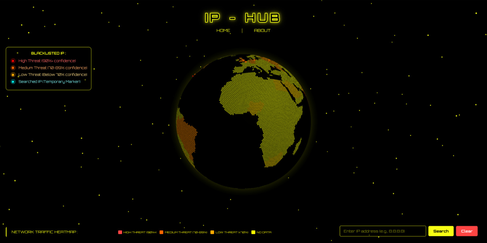
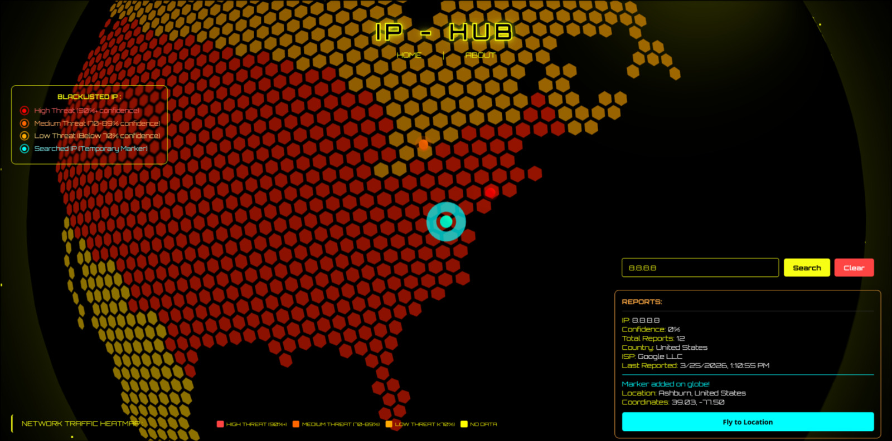

# 3D globe visualisation for cyber threat analyisis (IP-HUB)

This repository contains a personal web programming project using ThreeJS and FastAPI.

# Features

- **Network Traffic Heatmap** : Shows a network traffic heatmap for all countries (mock data).
- **Blacklisted IPs** : Once it loads, shows a list of recently blacklisted IPs fetched from abuseIPDB.
- **Searched IP** : Shows the details and location of a given IP, fetched from abuseIPDB and ip-api.

# Screenshots

